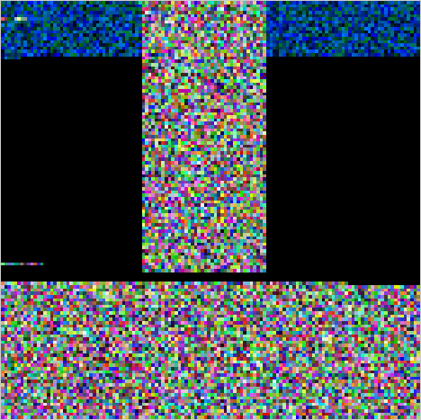

# Simple Bitmap

This contract allows users to set and query point values in a 2D grid (aka a bitmap). The state holds three variables:

* `x_size` and `y_size`: 8-bit unsigned integers that determine the grid size upon instantiation.
* `z_values`: A string made up of 6-character chunks that represent a 16-bit colour at each grid coordinate.



## Build Contract

Run the following from this sample folder:
```bash
cargo wasm
docker run --rm -v "$(pwd)":/code \
  --mount type=volume,source="$(basename "$(pwd)")_cache",target=/target \
  --mount type=volume,source=registry_cache,target=/usr/local/cargo/registry \
  cosmwasm/optimizer:0.16.0
```
This will build an optimized version of the contract under `simple-bitmap/artifacts/simple_bitmap.wasm`

## Run Contract

The commands shown below assume you have a `wasmd` network running with permissionless CosmWasm, as in:
```bash
wasmd q wasm params
code_upload_access:
  addresses: []
  permission: Everybody
instantiate_default_permission: Everybody
```

> Use the [`test-bitmap.sh`](test-bitmap.sh) script in this folder to store, instantiate, and execute the contract in a Gaia chain.

### Deploy Contract

Store the code:
```bash
wasmd tx wasm store path-to/simple_bitmap.wasm -o json | jq -r '.txhash'
# Wait for transaction to go on chain
code_id=$(wasmd query tx $tx_hash -o json | jq -r '.events[] | select(.type=="store_code").attributes[] | select(.key=="code_id").value')
```
Once the code has been stored, you can instantiate, execute, and query it. To instantiate it:
```bash
tx_hash=$(wasmd tx wasm instantiate $code_id '{"x_size":16,"y_size":16}' --label "bitmap" --no-admin -o json | jq -r '.txhash')
# Wait for transaction to go on chain
contract_address=$(wasmd query tx $tx_hash -o json | jq -r '.events[] | select(.type=="instantiate").attributes[] | select(.key=="_contract_address").value')
```

### Execute: Set values via CLI

Set values with the `set` function
```bash
wasmd tx wasm execute $contract_address '{"set":{"x":0,"y":0,"z":"0011AA"}}' # The x and y values must be within the limits set in the instantiate step
```

### Query values via CLI

Obtain the value of an individual point with the `get_point` function
```bash
result=$(wasmd q wasm contract-state smart $contract_address '{"get_point":{"x":0,"y":0}}' -o json | jq -r '.data.point')
echo "> Point: $result"
```

Obtain the full grid with the `get_grid` function
```bash
result=$(wasmd q wasm contract-state smart $contract_address '{"get_grid":{}}' -o json | jq -r '.data.z_values')
echo "> Full grid: $result"
```

### Render the grid

This folder includes a [webpage](index.html) that renders the `z_values` as a bitmap. You must set the following in the `API_URL` variable:
* Node API address (your target node must have API enabled)
* Contract address

The query is the `get_grid` JSON in base64:
```
echo '{"get_grid":{}}' | base64
eyJnZXRfZ3JpZCI6e319Cg==
```

The page will display an image similar to the one at the top of this document.